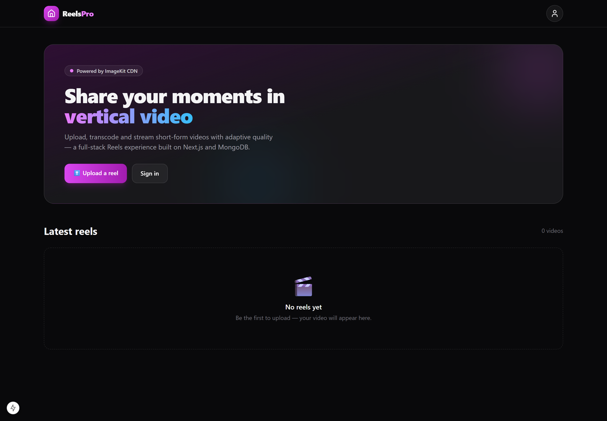
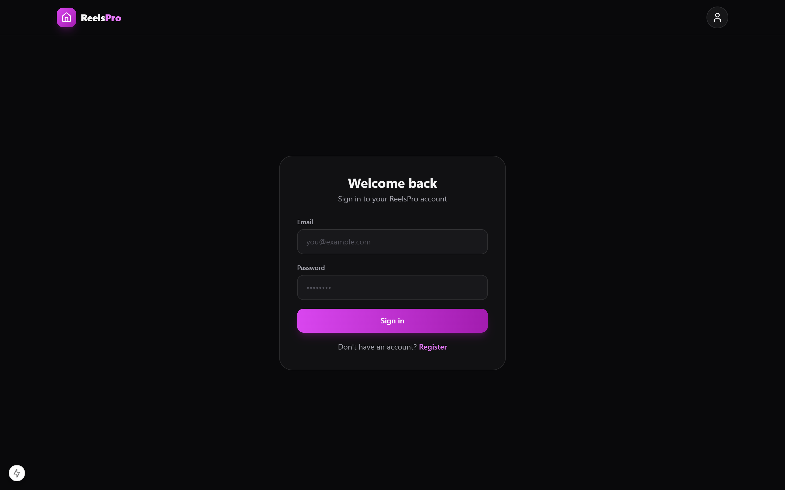

# 🎬 ReelsPro — Short Video Platform

> A full-stack Instagram Reels–style video platform built with Next.js 15, ImageKit for video CDN & transformation, NextAuth for authentication, and MongoDB for storage.


---

## 📸 Screenshots

| Home Feed | Login |
|-----------|-------|
|  |  |

---

## ✨ Features

- 🎥 **Video feed** — infinite scroll of vertical short-form videos
- ⬆️ **Video upload** — direct upload to ImageKit with progress tracking
- 🖼️ **Auto thumbnails** — generated from video via ImageKit transformation
- 📐 **Adaptive quality** — ImageKit real-time transcoding (height/width/quality)
- 🔐 **Auth** — NextAuth (credential + OAuth) with session management
- 👤 **User accounts** — register, login, profile
- 📱 **Responsive UI** — mobile-first vertical video layout (1080×1920)

---

## 🗂️ Project Structure

```
reelspro/
├── app/
│   ├── page.tsx                  # Home feed
│   ├── layout.tsx                # Root layout + providers
│   ├── login/                    # Login page
│   ├── register/                 # Register page
│   ├── upload/                   # Video upload page
│   ├── api/
│   │   ├── auth/                 # NextAuth handler
│   │   ├── videos/               # GET /api/videos, POST /api/videos
│   │   └── imageKit-auth/        # ImageKit signature endpoint
│   └── components/
│       ├── VideoFeed.tsx         # Feed list component
│       ├── VideoComponent.tsx    # Individual video player
│       ├── VideoUploadForm.tsx   # Upload form with ImageKit
│       ├── Header.tsx
│       ├── Notification.tsx
│       └── Providers.tsx         # SessionProvider wrapper
├── models/
│   ├── Video.ts                  # Mongoose video schema
│   └── User.ts                   # Mongoose user schema
├── lib/
│   ├── db.ts                     # MongoDB connection
│   ├── auth.ts                   # NextAuth config
│   └── api-client.ts             # Frontend API utility
└── .env.example
```

---

## 🚀 Getting Started

### Prerequisites
- Node.js `v18+`
- MongoDB (local or Atlas)
- [ImageKit](https://imagekit.io) account (free tier available)

### Setup

```bash
git clone https://github.com/jeetupal31/reelspro.git
cd reelspro
npm install
cp .env.example .env.local
# Fill in MongoDB URI, NextAuth secret, and ImageKit credentials
npm run dev
```

App runs at `http://localhost:3000`

---

## ⚙️ Environment Variables

```env
MONGODB_URI=mongodb://localhost:27017/reelspro
NEXTAUTH_SECRET=your_nextauth_secret
NEXTAUTH_URL=http://localhost:3000

NEXT_PUBLIC_IMAGEKIT_PUBLIC_KEY=your_public_key
IMAGEKIT_PRIVATE_KEY=your_private_key
NEXT_PUBLIC_IMAGEKIT_URL_ENDPOINT=https://ik.imagekit.io/your_id
```

---

## 🛠️ Tech Stack

| Layer | Technology |
|-------|-----------|
| Framework | Next.js 15 (App Router) |
| Language | TypeScript |
| Auth | NextAuth v4 |
| Database | MongoDB + Mongoose |
| Media CDN | ImageKit |
| Styling | Tailwind CSS |

---

## 👨‍💻 Author

**Jeetu Pal**
[](https://github.com/jeetupal31)

---

## 📄 License

MIT
